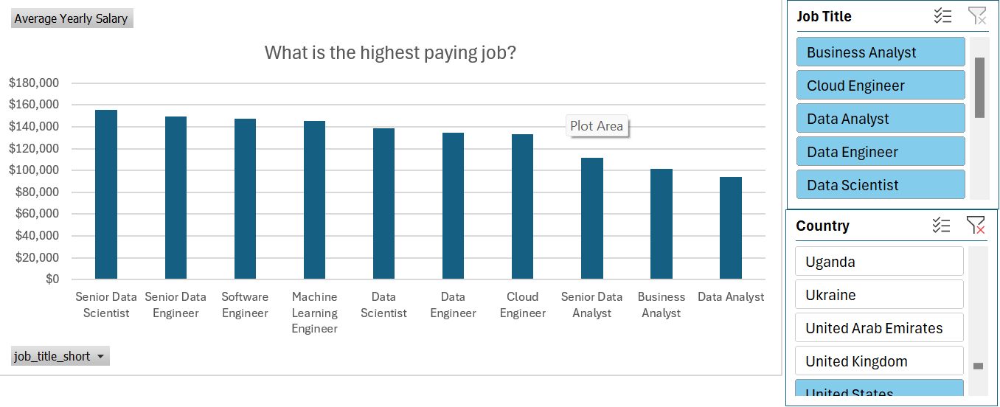
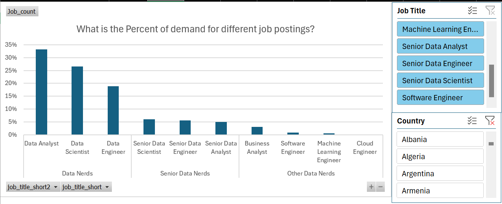
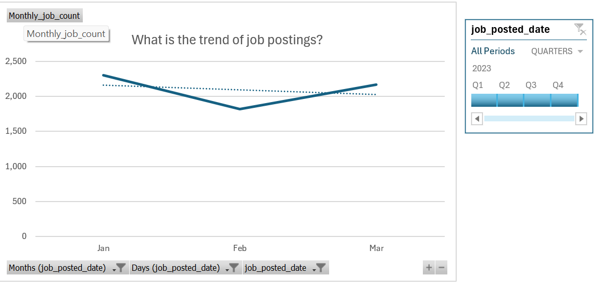

# 📊 Data Science Job Market Analysis — Pivot Table & Pivot Chart Project

## 📘 Overview
This project showcases my **Excel PivotTable** and **PivotChart** proficiency using real-world-style job posting data for **data science roles**.  
The dataset contains job listings, salaries, skills, and posting dates.  

I performed four major analyses using PivotTables, PivotCharts, slicers, and timelines to answer typical questions a **data science job seeker** might ask.

---

## 🧠 Scenario: “A Job Seeker Exploring the Data Science Market”
Imagine you’re an aspiring data scientist exploring job trends and salaries.  
You might ask:

1. 💰 **Which roles offer the highest average salaries?**  
2. 📊 **How are different levels of data professionals represented in the job market?**  
3. 📆 **How do job postings trend month by month? Are there hiring seasons?**

Each worksheet in this project answers one of these key questions.

---

## 🧾 Worksheet 1 — `Data`
**Goal:** Prepare and clean the raw job posting data.

**Key Steps**
- Fields include: *Job Title, Company, Salary, Posting Date,* and *Category*.  
- Data was formatted as an **Excel Table** to allow dynamic range references in PivotTables.  
- The source table powers all subsequent pivot analyses.

**Excel Skills Used**
✅ Table formatting  
✅ Data cleaning (removing blanks, ensuring numeric salary field)  
✅ Named ranges for reusability  

---

## 💵 Worksheet 2 — `Average_Salary` Analysis
**Question:** What are the top-paying jobs in data science?

**Pivot Setup**
- **Rows:** Job Title  
- **Values:** Average of Salary  
- **Filters/Slicers:** Industry, Location, Company  
- **Chart Type:** Clustered Column PivotChart  

**Insights**
- Highest-paying roles include **Data Engineer**, **Machine Learning Engineer**, and **Data Architect**.  
- Roles such as **Data Analyst** show consistent but moderate salaries.

**Excel Features Demonstrated**
✅ PivotTable (Average aggregation)  
✅ PivotChart (Bar/Column)  
✅ Slicers for interactive filtering  
✅ Conditional formatting for Top 5 salaries  

 

---

## 🧮 Worksheet 3 — `%_of_GT` (Distribution of Data Nerds)
**Question:** What is the share of each group of data professionals in the job market?

**Grouping**
- **Data Nerds** — entry-level or mid-level data analysts  
- **Senior Data Nerds** — advanced professionals (e.g., senior analysts, data engineers, data scientists)  
- **Other Data Nerds** — business-related or hybrid data roles  

**Pivot Setup**
- **Rows:** Data Group (`Data Nerds`, `Senior Data Nerds`, `Other Data Nerds`)  
- **Values:** Count of Job Title → *Show Values As → % of Grand Total*  
- **Chart Type:** Doughnut Chart or 100% Stacked Column  

**Insights**
- **Data Nerds** make up the largest portion of postings, reflecting strong demand for analysts.  
- **Senior Data Nerds** account for a smaller share — fewer but higher-level roles.  
- **Other Data Nerds** represent hybrid business-data positions.  

**Excel Features Demonstrated**
✅ “Show Values As” → % of Grand Total  
✅ Slicers for dynamic category filtering  
✅ Category grouping and labeling within PivotTable  

 

---

## 📅 Worksheet 4 — `Job_Trend`
**Question:** How do job postings trend over time?

**Pivot Setup**
- **Rows:** Month (derived from Posting Date)  
- **Values:** Count of Job Title  
- **Chart Type:** Line Chart  
- **Timeline Control:** Posting Date  

**Insights**
- Job postings rise steadily in **Q2** and **peak in Q3**, suggesting mid-year hiring cycles.  
- **Q4** often sees a slowdown, reflecting year-end budget constraints.

**Excel Features Demonstrated**
✅ PivotChart (Line with Markers)  
✅ Timeline for date filtering  
✅ Month grouping in PivotTable  

🖼️   

---

## 🧩 Key Takeaways
- **PivotTables** enable powerful, no-code data summarization.  
- **PivotCharts** and **Slicers** make dashboards interactive and visually engaging.  
- **Grouping** and **% of Grand Total** analysis provide instant insights into role distributions.  
- This workflow mirrors the **analytical approach of professional data analysts**.

---

## 🛠️ Tools & Techniques Demonstrated

| Feature | Description |
|----------|-------------|
| **PivotTable** | Summarize data dynamically by roles, salary, and category |
| **PivotChart** | Visualize insights as bar, pie, or line graphs |
| **Slicers** | Add interactive filters for roles or industries |
| **Timeline** | Control and filter data trends over time |
| **% of Grand Total** | Compare proportions in datasets |
| **Conditional Formatting** | Highlight top-performing job roles |

---

### 💼 In Summary
This Excel dashboard project demonstrates:
- End-to-end data cleaning and preparation  
- Advanced PivotTable and PivotChart usage  
- Interactive dashboard design using slicers and timelines  
- The ability to extract insights meaningful to **data-driven job seekers**

---

**Tools:** Microsoft Excel, PivotTables, PivotCharts, Timelines, Slicers  
**Focus:** Job market analysis for Data Science roles  
**Goal:** Demonstrate Excel dashboard & analytical storytelling capability
